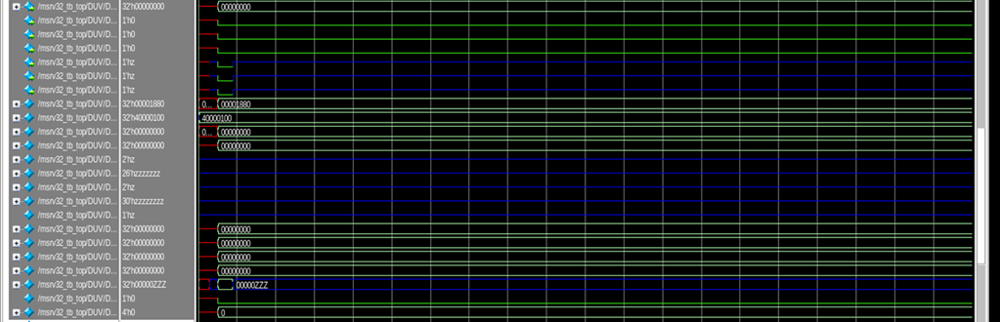

# VLSI-RiscV
Internship project code
# RISC-V RTL DESIGN
## Introduction
RISC-V is an open-source architecture for microprocessors that has the following blocks. I have coded these in Verilog during my internship in Maven Silicon using Intel Quartus Prime and Modelsim Altera software for simulation and verification purposes.
 
## Output Waveforms 

   
  Top Module

 

   
  PC MUX

 

   
  Reg Block 1

 

   
  Immediate Generator

 

   
  Immediate Adder

 

   
  Integer File

 

   
  Wire Enable Generator

 

   
  Instruction MUX

 

   
  Branch Unit

 

   
  Decoder

 

   
  Decoder

 

   
  Machine Control

 

   
  Machine Control

 

   
  Machine Control

 

   
  CSR File

 

   
  CSR File

 

   
  CSR File

 

   
  Reg Block 2

 

   
  Reg Block 2

 

   
  Store Unit

 

   
  Load Unit

 

   
  ALU

 

   
  WB MUX Selection Unit

 
